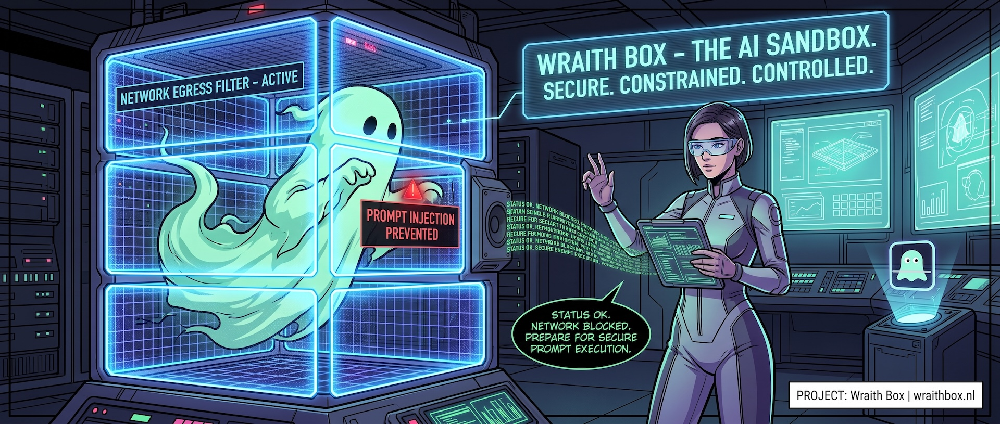

# Wraith Box



Run Claude Code inside an isolated virtual machine, with one command:

```bash
cd ~/src/my-project
wb claude                      # instead of: claude
wb claude --resume             # everything after `claude` goes to claude unchanged
wb --isolated claude           # wb's own flags go before the command
wb diff <session>              # review the work that came back
wb land <session>              # fetch it into your repo as a branch
```

Every command goes through `wb`, `gh`-style: `wb [wb flags] <command> [args]`.

> **Status: design phase.** The design is in [`docs/spec/`](docs/spec/).
> The code under `packages/` is a skeleton that compiles but does not
> run an agent yet.

## Why

Coding agents are most useful when they can run tools without asking for
permission at every step. Doing that directly on your Mac hands the agent
everything you can reach: your files, credentials, other repositories, and
accounts. A single prompt injection in a README, an issue, or a dependency
is enough to turn that access against you.

Wraith Box assumes the agent may be adversarial and capable, and enforces
every control that matters **outside** the sandbox:

- **Separate kernel.** Claude Code and every tool it starts run in a guest
  VM with native tooling for its OS. First target: macOS guests on Macs
  (Apple Virtualization framework) with Homebrew, Xcode command line
  tools, optionally Xcode.
- **No host files.** Nothing from your machine is mounted into the guest. The
  project arrives as a git clone; the agent's work comes back as a git
  branch you review and land. Changes to files your machine or CI might
  execute (hooks, build scripts, workflows) are flagged.
- **No secrets in the guest.** Not even the model credential. The guest
  holds placeholders; a host-side proxy strips whatever the guest sends
  and injects the real credential, so a token smuggled in by an attacker
  is never used.
- **Default-deny network.** Every packet from the guest goes to a
  userspace network stack on the host. Only allowlisted hostnames
  resolve, connections go only through a policy-enforcing proxy, pushes
  are limited to the project's own repositories, and fresh or vulnerable
  package versions are refused.
- **Fast.** A warm VM and a git clone on guest-native storage aim for a
  prompt in a few seconds and near-native filesystem speed.

## How it fits together


Start reading at [S03-requirements](docs/spec/S03-requirements.md), the
[security requirements](docs/requirements/SEC00-index.md), then
[S04-architecture](docs/spec/S04-architecture.md). Every spec is listed in
[S00-index](docs/spec/S00-index.md), and S01-spec-based-development
explains the IDs.

| Spec | Topic |
|---|---|
| [S03](docs/spec/S03-requirements.md) | The problem, and where the requirements are |
| [S04](docs/spec/S04-architecture.md) | Architecture: processes and boundaries |
| [S05](docs/spec/S05-cli.md) | The `wb` command |
| [S06](docs/spec/S06-vm-lifecycle.md) | Images, VMs, guest users, guest agent |
| [S07](docs/spec/S07-egress-gateway.md) | Network stack, DNS, proxy, dependency gate |
| [S08](docs/spec/S08-workspace-and-git.md) | Workspace and the git round trip |
| [S09](docs/spec/S09-policy-credentials-audit.md) | Policy, credentials, certificates, audit |
| [S10](docs/spec/S10-tech-stack.md) | Languages, libraries, packaging |
| [S11](docs/spec/S11-verification-and-spikes.md) | Verification and open questions |
| [S12](docs/spec/S12-platforms.md) | Host and guest platforms, WSL |
| [S13](docs/spec/S13-guest-confinement.md) | Guest confinement: Seatbelt, Network Extension, Endpoint Security |
| [S16](docs/spec/S16-terminal-stream.md) | The filter on guest output to the host terminal |

## Platforms

| Host ↓ / Guest → | macOS | Linux (Ubuntu LTS) | Windows 11 |
|---|---|---|---|
| macOS 15+, Apple Silicon | **first target** | later | later |
| Windows 11 Home / Pro (and `wb` inside WSL) | not possible | later | later |
| Linux (Ubuntu LTS) | not possible | later | later |

No root or administrator rights and no extra user accounts on the host
at run time. Most code is cross-platform Go; platform-native code (Swift
on macOS) is kept to small, separate components. See
[S12-platforms](docs/spec/S12-platforms.md).

## Development

Go (built and tested on macOS, Linux, and Windows) and Swift (macOS),
plus an Astro Starlight documentation site published at
[wraithbox.nl](https://wraithbox.nl). Toolchains and tasks are managed
by [`mise`](https://mise.jdx.dev/). Swift comes from Xcode.

```bash
mise trust && mise install   # pinned toolchains
mise run install             # docs site dependencies
mise run ci                  # lint + typecheck + test + build (offline)
mise run vuln                # dependency vulnerability scan (network)
mise run doc:dev             # docs site dev server
```

```
packages/
  wraithbox-go/      wb, wb-hostd, wb-netd, wb-proxyd, wb-guestd, internal/platform
  wraithbox-swift/   wb-vmd for macOS and the WraithBoxVM library
  wraithbox-doc/     documentation site
docs/spec/           specifications
```

See [AGENTS.md](AGENTS.md) for conventions and [CONTRIBUTING.md](CONTRIBUTING.md)
for the contribution process.

## License

Apache-2.0. See [LICENSE](./LICENSE).
