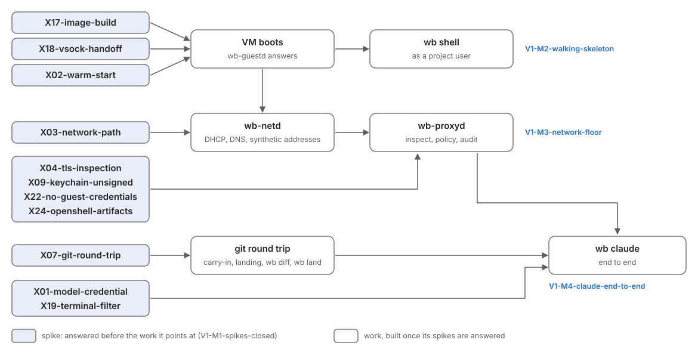

# Initial implementation plan

**Status:** Draft, 2026-10-04. The specs in `docs/spec/` are
authoritative. This page orders the work toward v1 (macOS host, macOS
guest) and lists what must be answered before milestones and
implementation issues can be cut. Real milestones replace it once
they exist.

## Where things stand

- **Specs** S03-requirements to S13-guest-confinement are drafts. X00-index lists 24 open questions
  (spikes X01-model-credential to X24-openshell-artifacts). None is answered yet.
- **Go** (`packages/wraithbox-go`): the `wb` command-line parser
  (`internal/cli`), the host and guest platform matrix
  (`internal/platform`), and empty `main` packages for `wb`,
  `wb-hostd`, `wb-netd`, `wb-proxyd` and `wb-guestd`.
- **Swift** (`packages/wraithbox-swift`): a `wb-vmd` executable and a
  `WraithBoxVM` library with a version constant.
- Nothing else yet: `proto/`, VM code, network code and milestones
  are all still to come.

## Approach

1. **Spikes and spec decisions first** (V1-M1-spikes-closed). Most components
   rest on an assumption that a spike tests, and some specs
   disagree with each other or leave a hole. Building before those are
   settled means rebuilding.
2. **Host floor before features.** Boot a guest, then cut its network
   down to the gateway, then return work through git. Each step ends
   with conformance checks from S11-verification-and-spikes for the controls it brings.
3. **Pure logic in parallel.** Parsers and policy code that face guest
   bytes need no VM. Builders can write them, with fuzz targets, while
   the VM spikes run, once the spike or decision they depend on is
   merged.

## Critical path

The VM spikes (X02-warm-start, X03-network-path, X05-fs-benchmark to X08-data-disk, X17-image-build, X18-vsock-handoff, X20-shared-homebrew) share one constraint:
a Mac runs at most two macOS guests at a time (NFR05-two-macos-vms). Only one or two of
them can run at once per machine (I50).

## Components and what they wait on

| Component | Work that needs no VM | Waits on |
|---|---|---|
| `wb` | TTY relay against a local test server, session and project naming | X19-terminal-filter (I30), I37, I42, I46 |
| `wb-hostd` | settings loader, `state.db`, audit writer, risky-path flagger (S08-workspace-and-git) | I52, I46, X07-git-round-trip (I21), X24-openshell-artifacts (I35) |
| `wb-vmd` (Swift) | none | X02-warm-start (I16), X17-image-build (I28), X18-vsock-handoff (I29) |
| `wb-netd` | DHCP and DNS logic on gVisor's in-memory link, with fuzz targets | X03-network-path (I17), I36, I51 |
| `wb-proxyd` | ClientHello parsing, leaf issuing with a software key, HTTP rule matching | X04-tls-inspection (I18), X09-keychain-unsigned (I23), X21-dep-gate-registries (I32), X22-no-guest-credentials (I33), I39 |
| `wb-guestd` | user and PTY logic behind interfaces | X18-vsock-handoff (I29), X06-guest-xcode (I20), X08-data-disk (I22), X20-shared-homebrew (I31) |
| network policy | OpenShell schema parser with a bounded YAML decoder | X24-openshell-artifacts (I35) |
| `internal/platform` | paths, local IPC with peer checks | none |
| Claude Code in the guest | none | X01-model-credential (I15), I45 |

## Milestones

The milestones are in V1-initial, from V1-M1-spikes-closed to
V1-M6-release-gate, each with its exit criterion. They are proposals
until the maintainer confirms them and the GitHub milestones exist.

## Issues filed for V1-M1-spikes-closed

Spikes from X00-index. X14-flow-attribution (I10), X15-endpoint-security (I11) and X16-openshell-linux (I12) were filed
before this plan, and don't block v1.

| Spike | Issue | Needs |
|---|---|---|
| X01-model-credential Model credential via the proxy | I15 | maintainer's Claude subscription |
| X02-warm-start Warm start | I16 | VM |
| X03-network-path Network path | I17 | VM |
| X04-tls-inspection Inspection compatibility | I18 | |
| X05-fs-benchmark Filesystem benchmark | I19 | VM |
| X06-guest-xcode Guest users and Xcode | I20 | VM |
| X07-git-round-trip Git round trip | I21 | |
| X08-data-disk Data disk for homes | I22 | VM |
| X09-keychain-unsigned Keychain access without a signing identity | I23 | |
| X10-linux-hypervisor Linux VMM and packet transport (later) | I24 | Linux machine, after X16-openshell-linux |
| X11-windows-host Windows host through HCS (later) | I25 | Windows 11 Home machine |
| X12-wsl-channel WSL client channel (later) | I26 | Windows machine |
| X13-windows-guests Windows guests on a macOS host (later) | I27 | Windows media |
| X17-image-build Unattended image build | I28 | VM |
| X18-vsock-handoff Host-guest socket and descriptor hand-off | I29 | VM |
| X19-terminal-filter Terminal stream filtering | I30 | |
| X20-shared-homebrew Homebrew with more than one project user | I31 | VM |
| X21-dep-gate-registries Dependency gate on real registries | I32 | |
| X22-no-guest-credentials Clients without guest credentials | I33 | |
| X23-sandboxed-daemons Self-sandboxed Go daemons on macOS | I34 | |
| X24-openshell-artifacts OpenShell artifacts | I35 | |

Spec gaps, contradictions and missing specs:

| Issue | Topic | Blocked by |
|---|---|---|
| I36 | Network flows in the shared work VM can't be attributed to a project | |
| I37 | The host terminal stream as a boundary | I30 |
| I38 | Port forwarding and clipboard design and threats | |
| I39 | CA name constraints and rotation versus live policy changes | |
| I40 | Learn mode and pass mode as SEC05-default-deny exceptions | |
| I41 | Which git data reaches the guest, and host git as a parser | |
| I42 | Configuration trust versus VM placement, project identity | |
| I43 | VM slot admission for image builds and GUI work | I20 |
| I44 | Data disk durability, never mounting a guest-written disk | I19, I22 |
| I45 | New spec S14: Claude Code in the guest, agent interface | I15 |
| I46 | Session lifecycle, detach, sleep and failure | |
| I47 | Non-HTTP streams, SSH remotes and ECH | |
| I48 | Process supervision, version skew, host resource limits | |
| I49 | Installation, restore image download, upgrades | I23, I28 |
| I50 | Test infrastructure for work that needs a VM | |
| I51 | Approval flow and approval noise | I17, I36 |
| I52 | First `.proto` contracts and settings schema | I29, I46 |

## Read these first

The spec decisions I36 to I52 each have a review brief, and B00-index
orders them by impact and risk. Of the spikes, X20-shared-homebrew
(I31), X19-terminal-filter (I30), X22-no-guest-credentials (I33) and
X21-dep-gate-registries (I32) can move the design most: shared
Homebrew breaks SEC08-proj-isolation without root, and the other three
decide whether B37-terminal-boundary, FR07-toolchain-manifest and
SEC07-dep-gate are usable as specified.

## Next steps

1. Triage the issues above: labels, priority, `ready-for-agent` or
   `ready-for-human`. Done on 2026-10-04 for the v1 spikes. X10-linux-hypervisor to
   X16-openshell-linux stay in `needs-triage` until after V1.
2. Create milestone V1-M1-spikes-closed and put the triaged v1 spikes and spec issues in
   it. Done on 2026-10-04, with V1-M2-walking-skeleton to V1-M6-release-gate created
   empty. I50 is decided: VM spikes run one at a time on the maintainer's Mac.
3. As V1-M1-spikes-closed closes, rewrite this page into milestones
   V1-M2-walking-skeleton to V1-M6-release-gate with
   implementation issues per component, each written to the
   `ready-for-agent` standard in `docs/agents/planning.md`.
