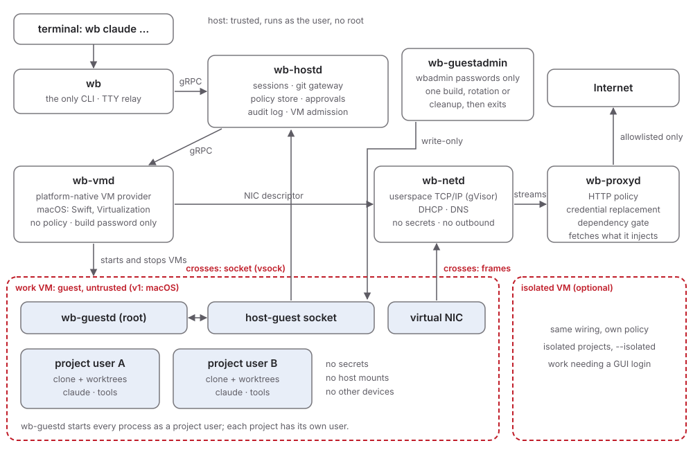

# S04 - Architecture

**Purpose:** Name the processes, the boundaries between them, and which
requirement each boundary serves.

## Overview



Exactly two channels cross the VM boundary: the **host-guest socket**
(vsock on macOS and Linux, Hyper-V sockets on Windows; terminated by
`wb-hostd`) and **Ethernet frames** (terminated by `wb-netd`). There is
no shared directory, no NAT to the host network, and no other device
that carries data (SEC01-separate-kernel, SEC02-no-host-fs-share, SEC05-default-deny).

## Processes

| Process | Lang | Runs as | Holds | Faces the guest via | Purpose |
|---|---|---|---|---|---|
| `wb` | Go | user, per invocation | nothing | none | The only CLI: dispatcher for every command, TTY relay for agent sessions (S05-cli) |
| `wb-hostd` | Go | per-user service | policy, landing repos, state | host-guest socket | Sessions, git gateway, approvals, audit writer, admission control (S06-vm-lifecycle, S08-workspace-and-git, S09-policy-credentials-audit) |
| `wb-launcher` | Go, standard library only | user, started by `wb-hostd` before it confines itself (macOS only) | nothing | none | Start the programs in its fixed table when `wb-hostd` asks, so that each can confine itself ("Each host daemon is self-sandboxed") |
| `wb-git` | Go | user, per git gateway transfer, started through `wb-launcher` (on macOS) (decided in B34-sandboxed-daemons, not yet built) | nothing | pack data from the guest, through `wb-hostd` | Confine itself to one repository, then run `git receive-pack` or `git upload-pack` (S08-workspace-and-git) |
| `wb-prover` | Go | user, per boundary check (at `wb trust` and for an approval request whose result isn't cached), started through `wb-launcher` (on macOS); instance cap one per VM plus one for `wb trust` | nothing | repository policy, and a host name the guest asked for in an approval request, both through `wb-hostd` | Set its memory cap, confine itself to its inherited descriptors (the two documents and the result pipe), check the prover binary's hash, then run `openshell-prover check` with fixed arguments (S09-policy-credentials-audit) |
| `wb-vmd` | platform-native | user, spawned for `wb-hostd` (through `wb-launcher` on macOS) | VM handles | none (devices only) | Create, start, stop, save, and restore VMs; hand guest socket connections and the NIC endpoint to other processes (S12-platforms) |
| `wb-netd` | Go | user, one per VM, spawned for `wb-hostd` (through `wb-launcher` on macOS) | nothing | Ethernet frames | Network stack, DHCP, DNS, stream hand-off (S07-egress-gateway) |
| `wb-proxyd` | Go | user, spawned for `wb-hostd` (through `wb-launcher` on macOS) | credentials, CA signing handle | streams from `wb-netd` | HTTP policy, credential replacement, dependency gate, upstream connections (S07-egress-gateway, S09-policy-credentials-audit) |
| `wb-guestd` | Go | root / SYSTEM inside the guest | nothing | n/a (runs in the guest) | Users, PTY exec, git transport (S06-vm-lifecycle) |

Native user-interface helpers (notifications with actions, later a tray
or menu-bar item) are separate small processes per platform. They render
approval requests and return the user's answer to `wb-hostd`, and decide
nothing themselves (S12-platforms).

## Design decisions

- **One CLI, dispatcher style.** `wb` is the entry point for every
  command. Agent commands (`wb claude …`) pass every following argument
  to the agent untouched, so the agent's own flags and subcommands can
  never collide with Wraith Box's (S05-cli).
- **Cross-platform core, native edges.** Session management, policy,
  approvals, audit, the git gateway, the network stack, the proxy, the
  guest agent, and the CLI are Go and the same on every host OS. Only the
  pieces that must call a platform API with no good Go binding are
  native, and each is a separate process behind a gRPC contract with no
  policy decisions of its own: `wb-vmd` on macOS (Virtualization
  framework) and the user-interface helpers (S12-platforms, NFR07-maintainability).
- **Secrets live in one process, and not the most exposed one.**
  `wb-netd` parses raw guest packets, the largest attack surface, and
  holds no secrets and opens no outbound connections. `wb-proxyd` holds
  credentials but only sees TCP byte streams already reassembled by
  `wb-netd` and validated against the DNS mapping. `wb-hostd` and
  `wb-vmd` never touch a credential (SEC04-no-guest-secrets, SEC12-least-privilege).
- **The VM provider passes descriptors, not bytes.** `wb-vmd` opens
  host-guest socket connections and creates the NIC endpoint, then
  hands the descriptors (handles on Windows) to `wb-hostd`, which
  passes the NIC endpoint on to that VM's `wb-netd`
  (S07-egress-gateway). Guest bytes stay out of `wb-vmd`'s code path:
  it does not relay or parse guest traffic, so the native code has the
  smallest possible exposure to guest input. The device set of a VM is
  fixed in `wb-vmd`'s code, and no device type is ever taken from the
  contract ("The device set is fixed and checked", below). On macOS
  (X18-vsock-handoff):
  - A vsock connection's descriptor is a Unix stream socket to
    Virtualization's own service process, which moves the bytes to
    the device. The receiver can't read the vsock ports from it, so
    `wb-vmd` sends them along.
  - The hand-off channel is a socketpair that `wb-hostd` passes to
    `wb-vmd` at spawn (`SOCK_SEQPACKET` or `SOCK_DGRAM`, no path). Each
    message carries exactly one descriptor and the fields request id,
    VM generation, direction, source port and destination port. The
    receiver refuses the message, closes any descriptor in it, and logs
    the refusal when the descriptor count is not one, the socket type
    is wrong, or the destination port is not one it asked for. The
    full contract is in I52.
  - The host opens every host-guest connection (B29-vsock-handoff).
    `wb-vmd` doesn't register a host vsock listener, so nothing in the
    guest can dial the host. `wb-hostd` asks `wb-vmd` to connect to
    `wb-guestd`, at boot, after each restore, and after `wb-guestd`
    restarts. `wb-hostd` routes a connection only on its destination
    port, which is the guest port it asked `wb-vmd` to connect to. A
    connection the guest opened would say nothing trustworthy about who
    opened it: every process in the guest that can open `AF_VSOCK` can
    dial, and it picks its own source port.
  - Requests that start in the guest, from `git-remote-wb` and guest
    events, go to `wb-guestd` over a local Unix socket. There the peer
    user ID names the project user (S13-guest-confinement). `wb-guestd`
    sends them to `wb-hostd` on a connection the host opened: multiplexed
    on an existing one, or on a further connection the host opens at
    `wb-guestd`'s request. Each request names the project it came
    from, and the stream framing on that connection is a parser of
    guest bytes with a fuzz target (S11-verification-and-spikes).
  - Attribution fails closed (SEC08-proj-isolation, SEC10-audit).
    `wb-guestd` refuses a peer user ID that isn't an active, unlocked
    project user of this VM: root, system accounts, user IDs created
    at runtime, and a locked project user are all refused. `wb-hostd`
    refuses a request for a project that isn't in the VM's effective
    policy. Both log each refusal with the rule. Root in the guest can
    still pose as any project user, which T11-shared-vm-grants and the
    isolated slot cover.
  - A project user can't pose as `wb-guestd` (X27-vsock-confinement).
    On guests that use vsock (macOS and Linux, S06-vm-lifecycle),
    `wb-guestd` listens on a port below 1024, and every guest port
    `wb-hostd` connects to is below 1024. The guest kernel lets only
    root bind those ports, so no project process can take one
    while `wb-guestd` restarts, inside the Seatbelt profile or outside
    it. From 1024 up, any guest user can bind a free port, and in
    X27-vsock-confinement one answered the host as `wb-guestd` for
    21.7 s while launchd restarted the daemon. The session profile
    also denies `AF_VSOCK` sockets (S13-guest-confinement).
    `wb-guestd` logs and skips a failed `accept` (`ECONNABORTED`, which
    a guest process causes by connecting to the guest's own CID), so
    it never stops listening because of one.
  - `wb-vmd` caps the connections it has opened but not yet passed, and
    `wb-hostd` caps connections per VM and per project. Both log each
    refusal (SEC13-bounded-resources).
  - `wb-vmd` closes its copy of a descriptor once it has passed it.
    The passed descriptor keeps working, also while `wb-vmd` is
    stopped.
  - A restore ends every connection. The saved VM's descriptors read
    EOF when it stops, and the guest sees EOF on its old connections
    when the restored VM resumes. A frame written to the old network
    descriptor raises no error and draws no answer, so before `resume`
    `wb-hostd` passes the new network descriptor to `wb-netd` and
    resets that VM's TCP flows and their `wb-proxyd` streams, but not the guest's DHCP lease or the synthetic DNS name mapping that goes with it, so cached answers in the resumed guest still work. Each restore starts a new VM
    generation: hand-off messages and audit entries carry it, and a
    message from an older generation is refused. `wb-hostd` connects to
    `wb-guestd` again after every restore.
- **The device set is fixed and checked.** A VM's devices are the ones
  in S06-vm-lifecycle, "Devices", fixed in `wb-vmd`'s code
  (X25-vmd-sandbox, SEC02-no-host-fs-share, SEC05-default-deny):
  - Before every start and restore, `wb-vmd` checks its own description
    of the configuration against that set, before it creates any
    Virtualization device or attachment object. It refuses any other
    device, attachment, a second network device, and a disk or serial
    port file outside the VM's bundle. The check runs first because
    creating a disk attachment on a path the profile denies ends the
    confined process in an uncaught exception (X25-vmd-sandbox). Each
    refusal is logged with its rule (below) and returns the rule in the
    gRPC error.
  - On macOS, `wb-vmd`'s sandbox profile also refuses a shared
    directory, host audio input, and a disk or serial port file outside
    the bundle, and it denies the lookup of the host clipboard service
    (the effect in the guest is untested).
  - The profile can't refuse a NAT network, which Apple's
    Virtualization service provides and which would bypass `wb-netd`
    and `wb-proxyd`, nor a disk in the bundle or a device on a
    descriptor `wb-vmd` holds. Only `wb-vmd`'s code keeps those out.
    A bridged network failed both ways in X25-vmd-sandbox: confined,
    the framework offered no host interface to bridge to, and
    unconfined it refused the attachment without the
    `com.apple.vm.networking` entitlement, which `wb-vmd` isn't signed
    with.
  - Three checks verify the parts the profile doesn't enforce: a unit
    test of the check (S11-verification-and-spikes), an in-guest
    conformance check that the guest has one network interface with
    its lease from `wb-netd` (S11-verification-and-spikes), and a
    static check in CI that rejects at least
    `VZNATNetworkDeviceAttachment`, `VZBridgedNetworkDeviceAttachment`,
    `VZSharedDirectory`, `VZVirtioFileSystemDeviceConfiguration`,
    `VZHostAudioInputStreamSource`, `VZSpiceAgentPortAttachment` and
    `VZVirtioSoundDeviceInputStreamConfiguration` in `wb-vmd`'s sources outside its
    tests (a grep or a SwiftLint custom rule, not yet built).
- **Each host daemon is self-sandboxed.** Host processes confine
  themselves at startup with the platform's mechanism (S12-platforms) so that
  each gets only what it needs: `wb-netd` no filesystem and no network
  beyond inherited descriptors; `wb-proxyd` outbound network and its
  credential store items; `wb-hostd` its state directories; `wb-vmd` the
  hypervisor and the VM bundles. This hardens our own code; it is not how
  the agent is contained (the VM is). How it is done (X23-sandboxed-daemons,
  SEC12-least-privilege):
  - A daemon confines itself first thing in `main`, from a profile
    compiled into it, and exits if that fails. Nothing before that reads
    an inherited descriptor, the arguments or the environment. Right
    after, it tries one operation its profile denies, and exits if that
    succeeds.
  - `wb-hostd` is one exception. Before it confines itself, it reads its
    own configuration, sets `GOMAXPROCS`, loads the local time zone,
    starts `wb-launcher` (on macOS), resolves the git binary from
    `<config>` or the fixed platform path, never from `PATH`, checks
    its version against the minimum (S08-workspace-and-git, "Host git")
    and that it honors `GIT_ALLOC_LIMIT` (S08-workspace-and-git, "Pack
    scanner"), and works out the paths for its profile. None of that reads
    anything the guest sent.
  - `wb-vmd` on macOS is a second, bounded exception. Before it confines
    itself, it calls `confstr(_CS_DARWIN_USER_CACHE_DIR)` once, because
    the framework needs the per-user cache directory and the lookup
    goes to a system service the profile denies. libSystem keeps the
    answer. It also looks up the user's home directory and resolves the
    bundle path with `realpath`, to get its profile parameter. It
    doesn't read anything from the guest or `wb-hostd` before it
    confines itself.
    The profile's parameters are the bundle path, from the fixed
    platform path (S12-platforms, "Paths") resolved to its real path,
    and the cache directory from `confstr`. The gRPC contract carries
    no path. The profile allows reading and writing the bundles, the
    Virtualization service, the `sysctl` values and system files the
    framework checks (the CPU name among them, without which saved
    states don't restore across profiles), and the sandbox extensions
    the framework hands to its service process, with the cache
    directory extension limited to its `com.apple.metal-` and
    `com.apple.paravirtualizedgraphics-` entries. It denies the user's
    other files, the network, starting programs, and other services
    (X25-vmd-sandbox). The extension classes were measured with the
    X18-vsock-handoff configuration, which also had a Mac graphics
    device with one display and a USB keyboard and pointer. They are
    ablated again against the final device set of S06-vm-lifecycle.
  - Open (X25-vmd-sandbox, decision 1): one `wb-vmd` serves both VMs
    and can read and write all of `<data>/vms`. A compromise of
    `wb-vmd` that starts in the isolated VM, through framework code
    that runs in `wb-vmd`'s process, then reaches the work VM's disks
    and saved state, which breaks the separation SEC08-proj-isolation
    puts the isolated VM there for. Recommended: one `wb-vmd` per VM,
    with two fixed `wb-launcher` entries (`wb-vmd-work`,
    `wb-vmd-isolated`), each with that VM's bundle as its profile
    parameter. Each instance learns its slot without arguments, from
    its program path (two installed names for one binary) or from a
    fixed environment variable in its launcher entry. Which of the two
    is part of this decision. If the maintainer keeps one `wb-vmd`, T00-index records
    the residual risk.
  - Open (X25-vmd-sandbox, decision 2): installing from a restore image
    needs three more rules (reading the image, a read extension for
    it, and the installation service). Recommended: a fixed
    `wb-launcher` entry, `wb-vmd-install`, whose compiled-in profile
    adds them, with the restore image at a fixed path under
    `<data>/images/`. The request doesn't choose the mode or a path.
  - `wb-netd` and `wb-vmd` write their logs to an inherited pipe or
    socket to `wb-hostd`, which frames, attributes and rate-limits each
    line. Neither holds a descriptor on any file in `<logs>` or
    `<data>` for its log.
  - On macOS a confined process can't confine itself again, and its
    children inherit its profile. So `wb-hostd` starts `wb-vmd`,
    `wb-netd` and `wb-proxyd` through `wb-launcher`, which has no
    profile. On Linux, Landlock and seccomp restrictions stack, so a
    child can confine itself further and needs no launcher (assumed from
    their documentation, not tested; to be confirmed when Linux
    self-sandboxing is built).
    `wb-launcher` doesn't widen what a compromised `wb-hostd` can do
    only while all of these hold:
    - It is a separate, small program that uses only the Go standard
      library, not `wb-hostd` started in another mode.
    - Its request channel is a `SOCK_SEQPACKET` or `SOCK_DGRAM`
      socketpair inherited at start, never a path. Each message is one
      fixed-format request. A request with unexpected descriptors has
      them closed and is refused.
    - It starts each program with no arguments and a fixed environment.
      It passes only the descriptors `wb-hostd` hands it. The one
      bounded exception is `wb-git`, below.
    - Each program's profile and its parameters are compiled into it or
      come from configuration `wb-hostd` read before it confined
      itself, never over the request channel.
    - Its program table holds absolute paths in the installed bundle,
      never under `<config>`, `<data>` or `<logs>`, and it checks that
      when it starts.
    - Each program has an instance cap (SEC13-bounded-resources).
  - git, which the git gateway runs on data the guest sends, starts
    through `wb-launcher` as `wb-git`, a shim that applies a profile for
    one repository and then runs git (decided in B34-sandboxed-daemons,
    not yet built). The launcher table
    has two fixed entries, `wb-git-receive` (`git receive-pack`) and
    `wb-git-upload` (`git upload-pack`), so the subcommand is never a
    free string. Besides its program, a `wb-git` request holds one
    field, the repository. `wb-launcher` takes the real path of the
    projects root (`<data>/projects`, from configuration `wb-hostd` read
    before it confined itself) once, when it starts. It accepts the
    repository only if it equals, after cleaning,
    `<real path of the projects root>/<id>/<basename>`, with `<id>` in
    the project ID format and `<basename>` either `landing.git` or
    `export.git` (I41). It never resolves the request string itself,
    which would follow a symbolic link an attacker placed. The shim
    repeats the same check before it calls `sandbox_init`. The
    repository becomes the shim's profile parameter and git's one path
    argument. This is the one bounded exception to "no arguments". The
    Seatbelt match on the resolved path is the control that matters,
    and the path check is defense in depth (X23-sandboxed-daemons).
    Instead of a path, `wb-hostd` could hand over an inherited
    directory descriptor that the launcher checks with `F_GETPATH`,
    which keeps the path out of the request. That is the fallback if
    the path check turns out to be fragile.
  - The measured, weaker fallback is git as a child of `wb-hostd`,
    under the `wb-hostd` profile. A git bug would then reach every
    project's policy, the approvals in `state.db`, other projects'
    landing repositories, and the audit log. The maintainer chose the
    `wb-git` shim on I34. Falling back would need a spec change and a
    T00-index entry for the residual risk.
  - Open: `wb-hostd` can't read the user's repository under its profile,
    which S08-workspace-and-git's `upload-pack` and export repository
    need (I67).
- **Everything in the guest is untrusted, including `wb-guestd`.** The
  host validates every message from the guest as adversarial input. The
  guest agent is a convenience for the host, not a security component.
- **Guest confinement narrows, never widens.** Controls inside the
  guest (Seatbelt profiles, a Network Extension that labels flows with
  the program that opened them) can only deny what the host would allow.
  Every `SEC*` control holds without them (S13-guest-confinement, T06-forged-labels).
- **Policy is evaluated on the host, twice.** `wb-netd` decides which
  names resolve and which connections are accepted; `wb-proxyd` re-checks
  the hostname, SNI, and HTTP request. A bug in one layer does not open
  egress on its own.
- **One work VM per guest OS, many projects; an isolated VM for the
  rest.** The work VM hosts every trusted project for its guest OS,
  separated by guest user accounts; an isolated VM takes untrusted
  repositories. For macOS guests this fits Apple's two-VM limit (SEC08-proj-isolation, NFR05-two-macos-vms).
  The accounts keep the projects' files apart. The host can't tell
  their connections apart, so it enforces the policy and the
  credential bindings of a VM's projects for the whole VM
  (S07-egress-gateway, "Enforced per VM", T11-shared-vm-grants).
- **No root or administrator rights at run time.** The packet transport
  and the userspace stack replace host networking features that would
  need them (SEC12-least-privilege, NFR04-host-platforms).

## Host state

Locations follow each OS's conventions (paths in S12-platforms); the logical
layout is the same everywhere:

```
<config>/                             user-editable configuration (S09-policy-credentials-audit)
  config.toml                         global settings and defaults
  policy.yaml                         global network policy (S09-policy-credentials-audit)
  projects/<project-id>.toml          per-project settings, toolchain manifest reference
  projects/<project-id>.policy.yaml   per-project network policy
<data>/
  images/                             base images (copy-on-write clones)
  vms/<guest-os>-{work,isolated}/     VM bundles: disks, machine identity, saved state
  projects/<project-id>/export.git    bare repo the guest fetches from: selected refs only (S08-workspace-and-git)
  projects/<project-id>/landing.git   bare repo receiving session branches (S08-workspace-and-git)
  state.db                            SQLite: projects, sessions, approvals, caches
  run/                                user-only directory for local IPC endpoints
<logs>/                               audit JSONL and daemon logs
```

## Inter-process contracts

All IPC is protobuf over gRPC. On the host it runs over a local IPC
endpoint only the user can open: Unix sockets in a `0700` directory on
macOS and Linux, named pipes with an ACL for the user's SID on Windows.
The peer's identity is checked on every connection. To the guest it runs
over the host-guest socket. The `.proto` files are the single contract
for every language (S10-tech-stack).

**Status:** Draft
