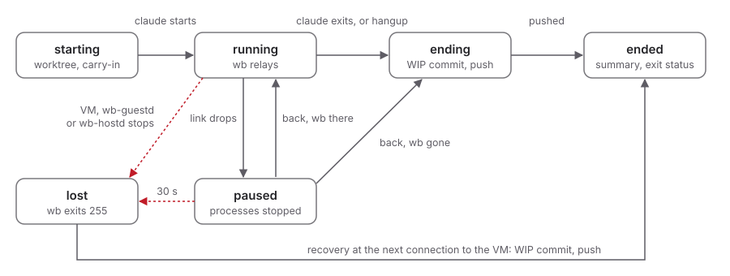

# S06 - VM Lifecycle, Images and the Guest Agent

**Purpose:** How guest images are built, how VMs are kept warm, how
projects and sessions map onto guests, and what `wb-guestd` does.

**Requirements:** FR02-any-repo, FR05-parallel-sessions to FR07-toolchain-manifest, FR11-port-forward to FR14-ephemeral, SEC01-separate-kernel, SEC02-no-host-fs-share, SEC08-proj-isolation, SEC11-root-gains-nothing, SEC13-bounded-resources, NFR01-startup to NFR05-two-macos-vms.

This spec describes macOS guests on a macOS host, the v1 target. The
structure (image layers, sealing, work and isolated VMs, one guest user
per project, worktree per session, the duties of `wb-guestd`) is the
same for every guest OS. What differs per guest and per host is listed
in S12-platforms.

## Images

- **Layers.** (1) *Base*: macOS installed from an Apple restore image,
  plus `wb-guestd`, Homebrew, and Xcode command line tools; an Xcode
  variant adds full Xcode. (2) *Org layer* (optional): a shared Brewfile
  and settings. (3) *Project layer*: the project's Brewfile, reconciled
  inside the project user's environment at session start (FR07-toolchain-manifest).
  The image doesn't contain a Wraith Box CA. `wb-guestd` installs the
  VM's CAs at runtime (S09-policy-credentials-audit, "TLS inspection certificate
  authority").
- **Built by Wraith Box.** `wb image build` installs macOS into a new
  VM, then provisions it through `wb-guestd` (no SSH, no guest network
  credentials). Builds are scripted and repeatable; nobody configures an
  image by hand.
- **Guest confinement.** The base image includes the Network Extension
  of S13-guest-confinement, approved during the build, once spike X14-flow-attribution allows it.
- **Sealing.** Before an image is usable it is scanned for anything that
  looks like a secret (keychain items, tokens in dotfiles, SSH keys,
  shell history). A non-empty result fails the build (SEC04-no-guest-secrets).
  The scan also fails the build on an enabled account in the `admin`
  or `wheel` group other than root, and on a sudoers entry beyond the
  ones macOS ships, so any admin account the build creates is disabled
  or removed before the image is sealed (X27-vsock-confinement).
- **Storage and distribution.** Images are stored locally and cloned
  copy-on-write (APFS clones on macOS; S12-platforms) into VM bundles.
  Sharing images between machines as OCI artifacts in a registry is a
  later addition.
- **Updates.** A VM's system disk is replaced by a fresh clone of the new
  image. Project data is on a separate data disk and survives (below).

## VMs

- **Two slots per guest OS.** The **work VM** hosts every project whose
  `placement` is `work`. The **isolated VM** hosts projects whose
  `placement` is `isolated`, sessions started with
  `wb --isolated claude`, and work that needs a GUI login session.
  macOS allows at most two running macOS guests, including any started
  by other software: `wb-hostd` performs admission control and reports
  a clear error when a slot is unavailable (NFR05-two-macos-vms).
- **Placement and configuration trust.** `placement` (`work` or
  `isolated`) is a project setting (S09-policy-credentials-audit,
  "Settings contents"),
  and `wb project place` changes it (S05-cli). `--isolated` overrides
  it for one session. `config_trust` (`wb trust`) only decides whether
  `.wraithbox/` is read, and never moves a project between VMs.
- **New projects start in the work VM.** A newly registered project
  (FR02-any-repo) has `placement = work`, so it shares the grants of
  every work-VM project with a session (T13-new-project-grants). For a
  repository they don't trust, the user passes `--isolated` or sets
  `placement = isolated`. The maintainer decided this on I42
  (B42-trust-placement): projects in the work VM still run as separate
  guest users.
- **Changing placement.** A new `placement` applies from the next
  session start. `wb project place` is refused while the project has a
  session, and the refusal names the session. A project user's home,
  with its Claude Code state (FR13-claude-state) and commits not yet
  pushed, is on the data disk of the VM it ran in ("Disks"). Moving a
  home to the other VM's data disk needs the data-disk design of I44.
  Until I44 is decided and built, `wb project place` is refused for a
  project that has a home on any VM's data disk. The refusal names I44
  and today's way to isolate such a project: `wb project rm`, then
  `wb project place isolated` in the repository, which registers it
  again with no home, at the cost of its Claude Code state and
  approvals (NFR06-explained-refusals). So no home is left on the old VM,
  exposed to its other projects (T05-cross-proj-clones), and no
  session starts with an empty home without saying so. A new clone,
  which has no home yet, can still be placed before its first session.
- **Isolated slot to itself.** Projects in one VM share its network
  grants and credential bindings (S07-egress-gateway, "Enforced per
  VM", T11-shared-vm-grants). A project whose `placement` is
  `isolated` gets the isolated VM to itself, unless its settings mark
  it shared (S09-policy-credentials-audit, "Settings contents").
  `wb-hostd` refuses a session start that would put another project,
  or an `--isolated` session, in the isolated VM while such a project
  has a session there, and refuses that project's session start while
  another project has one there. The error names the other project
  (NFR06-explained-refusals). Sessions started with `--isolated`, and
  projects marked shared, may share the isolated VM with each other.
  They then share their grants, and after guest root their clones
  (T05-cross-proj-clones).
- **Disks.** A system disk (clone of the image) and a data disk holding
  project users' homes and workspaces, including Claude Code state
  (FR13-claude-state) and commits not yet pushed. The data disk is a
  raw sparse image file, attached with automatic host caching and full
  synchronization (on macOS, `VZDiskImageStorageDeviceAttachment` with
  `VZDiskImageCachingModeAutomatic` and
  `VZDiskImageSynchronizationModeFull`), so every write the guest
  flushes reaches permanent storage on the host. The relaxed modes are
  not used: X05-fs-benchmark found they don't speed up the
  NFR02-fs-speed workloads, and Apple's header says an image without
  synchronization "cannot safely be reused" after a host crash or
  power loss. A raw image gives the host back the space of data the
  guest deletes, and an ASIF image does not (X05-fs-benchmark).
  With these settings, `npm ci` on the data disk ran at about 71% of
  the host on a loaded host, under the 80% goal of NFR02-fs-speed. The
  goal is not a release gate.
- **Devices.** One virtio network device whose packet transport leads
  to `wb-netd` (on macOS a file-handle attachment; S07-egress-gateway, S12-platforms);
  one host-guest socket device (vsock); storage; entropy.
  No shared directories, no host audio input, no USB or serial
  passthrough in v1 (SEC02-no-host-fs-share). The spikes so far also
  gave each VM a Mac graphics device with one display and a USB
  keyboard and pointer (X02-warm-start, X18-vsock-handoff), and several
  of the sandbox extensions in `wb-vmd`'s profile serve them
  (X25-vmd-sandbox). Whether v1 keeps them is open, and
  `wb-vmd`'s profile is ablated again against the set chosen here.
  `wb-vmd` refuses any device not in this list
  (S04-architecture, "The device set is fixed and checked").
- **Resources.** CPU, memory, and disk are capped per VM; defaults
  4 vCPU / 8 GB, configurable (SEC13-bounded-resources).
- **Warm start.** `wb-hostd` can have `wb-vmd` start the work VM at
  login. After a configurable idle period the VM's state is saved and
  the VM stops; the next session restores from saved state (NFR01-startup, NFR03-footprint).
  The idle period runs only while the VM has no session, so a VM with
  a session is never saved for idleness ("Session lifecycle").
  A restore of an idle guest takes about 4 s (X02-warm-start), inside
  the 7 s goal of NFR01-startup for a suspended VM. A cold boot takes
  10.9 s (p50) and 13.5 s (p95) to the guest daemon's vsock
  listener, over the 10 s goal (X18-vsock-handoff). These goals aren't
  a release gate. A restore runs under these rules:
  - A saved state is restored only onto the disks and auxiliary
    storage it was saved with. Once the VM has run on from them, the
    state is deleted. The framework does not check this, and would
    restore old guest memory over newer disks. Restoring one state
    more than once needs APFS clones of the state, both disks and the
    auxiliary storage, taken together at the save, and a fresh clone
    for each restore.
  - The restored VM has the machine identifier and MAC address it was
    saved with, and no other VM with that identifier runs during the
    restore.
  - Saving needs the host user's session unlocked. When the idle
    period ends while the host is locked, the VM keeps running and is
    saved after the next unlock (decided on I16, B16-warm-start).
    Restoring needs it unlocked too: a restore while locked fails with
    "permission denied" (X18-vsock-handoff).
  - A restore ends every host-guest connection. `wb-hostd` connects
    to `wb-guestd` again after each one, which answers within about
    0.2 s of `resume` (X18-vsock-handoff).
  - A saved state works only on the host that wrote it, and may stop
    working after a host update. A restore that fails for one of these
    permanent reasons deletes the state, and `wb-vmd` cold boots the
    VM. A restore that fails for a temporary reason, such as another
    VM with the same identifier still running or a locked host, keeps
    the state.
  - Every restore failure has the same error code, `VZErrorRestore`
    (12), in Apple's `VZVirtualMachine.h`. Only the failure reason
    tells them apart, so `wb-hostd` never matches on the code alone.
    "Permission denied" comes from a locked host (X18-vsock-handoff)
    and from a state written on another host. "Invalid argument" comes
    from an identifier in use (X02-warm-start), from a host update, and
    from a state saved by a `wb-vmd` whose sandbox profile let it read
    different host facts, such as the CPU name (X25-vmd-sandbox).
  - `wb-hostd` decides permanence from evidence it owns. It records the
    host's hardware identity (the `IOPlatformUUID`) and the macOS build
    with each saved state in `state.db`. A mismatch with the running
    host is permanent, whatever the error. With a match, "permission
    denied" is temporary, and "invalid argument" is temporary while a
    VM with that identifier runs and permanent otherwise.
  - After a failure, `wb-hostd` reads the lock state and checks whether
    a VM with that identifier runs (both after the failure, not before
    the attempt). After a temporary failure, it retries a bounded number of
    times within a bounded wall time, and reports the reason when it
    gives up (NFR06-explained-refusals). `wb-vmd` passes the error
    code, the failure reason, any underlying errno and the
    description, and `wb-hostd` logs them with its classification.
  - When `wb-hostd` changes a VM's configuration (resources or
    devices), it deletes the saved state itself and logs why, rather
    than learning of the change from "invalid argument" at the next
    restore.
- **Time and sleep.** The guest has no network time: NTP is UDP, and
  `wb-netd` drops it (S07-egress-gateway, X03-network-path). Its clock
  comes only from `wb-hostd`, which sends its own time to `wb-guestd`,
  and `wb-guestd` sets the guest clock from it.
  - `wb-hostd` starts every update. It sends the time after every cold
    boot, every restore from saved state and every host wake, before
    the steps that depend on the time (S09-policy-credentials-audit,
    "TLS inspection certificate authority"), and every 60 seconds while
    the VM runs. Without the first update, a cold-booted guest starts
    from the virtual clock, and a restored guest lags by the time it
    spent saved (X18-vsock-handoff). The periodic update corrects drift
    and a change of the host clock within a minute.
  - `wb-hostd` never reads or uses a time value from the guest, and the
    guest has no message that asks for the time (S04-architecture,
    "Everything in the guest is untrusted"). The guest can't make
    `wb-hostd` send more updates than this schedule.
  - `wb-guestd` steps the clock to the host's time after a cold boot, a
    restore or a host wake, and when the guest is more than 1 second
    off. Otherwise it slews the clock, so a running build never sees
    the wall clock go backward. Drift between two updates 60 seconds
    apart stays far below 1 second. A larger offset means the host
    clock changed or an update was missed, and slewing it off at NTP's
    limit of 500 ppm would take more than half an hour.

## Projects and sessions inside a VM

- Each project gets a dedicated **guest** user account, created by
  `wb-guestd`; its home on the data disk holds the project clone, Claude
  Code state (FR13-claude-state), and tool caches. Guest users cannot read each other's
  homes (SEC08-proj-isolation). No host user accounts are created (SEC12-least-privilege).
- A project user is a standard account, outside the `admin` and
  `wheel` groups, with no sudoers rule. Guest root can bind
  the host-guest socket port of `wb-guestd`, so a project user must not
  reach root through `sudo` (X27-vsock-confinement). X20-shared-homebrew
  has to work within this.
- Each session gets its own git worktree of the project clone, at
  `<home>/sessions/<session-id>` in the project user's home, so
  parallel sessions in one project do not collide (FR05-parallel-sessions). Per-session build
  outputs (for example Xcode DerivedData) are kept inside the worktree.
- Claude Code keeps its conversations per working directory:
  `claude --continue` resumes "the most recent conversation in the
  current directory" (`claude --help`, Claude Code 2.1.289), under
  `~/.claude/projects/<directory>`, where `<directory>` is the path
  with each character other than a letter or digit replaced by `-`.
  Each session has a new worktree path, so before it starts `claude`,
  `wb-guestd`, running as the project user, makes that directory for
  the new worktree a symbolic link to one directory per project,
  `~/.claude/projects/wb-project`. `--continue` and `--resume` then
  find the conversations of the project's earlier sessions
  (FR13-claude-state). The link is made as the project user, so
  `wb-guestd` never follows a link the project user made with root's
  rights. Parallel sessions share that directory, so `--continue` in
  one can pick the conversation another session is running. The layout
  was read on a macOS host, not checked in a guest, and I135 checks it
  there.
  Rejected: one worktree path for every session, which a parallel
  session, or an ended session that isn't discarded yet, still holds.
- Ephemeral sessions use a throwaway guest user removed at session end
  (FR14-ephemeral).

## Session lifecycle

A session runs from `wb claude` to its summary. `wb-hostd` keeps each
session's record and state in `state.db` (S04-architecture, "Host
state"), and `wb-guestd` holds the session's processes and, in
interactive use, its terminal device (PTY). The maintainer decided on
I46 (B46-session-lifecycle) that closing the terminal ends the
session. V1 has no detach and no `wb attach`, and a session has one
client, the `wb` process that started it.

| State | What holds | Next |
|---|---|---|
| starting | `wb-hostd` admits the session, starts or restores the VM, and `wb-guestd` creates the worktree and applies the carry-in (S08-workspace-and-git) | running when `claude` starts. After a refusal or a failure before that, `wb` exits with 255, and `wb-guestd` removes a worktree it made |
| running | `claude` runs, and `wb` relays its terminal or its streams (S05-cli) | ending, paused, or lost |
| paused | the host-guest link is down, and the session's process group is stopped (S13-guest-confinement, "Layer 1") | running, ending, or lost |
| ending | `claude` has exited or was killed, and `wb-guestd` commits WIP and pushes (S08-workspace-and-git, "Session end") | ended |
| lost | the session's VM, its `wb-guestd`, or `wb-hostd` stopped under it | ended, by recovery |
| ended | the exit status and the summary are in `wb sessions`, and the returned work stays until `wb land` or `wb discard` | |

- **Closing the terminal ends the session.** When `wb` gets `SIGHUP`,
  or its connection to `wb-hostd` closes for any reason (`wb` was
  killed or crashed), `wb-hostd` has `wb-guestd` hang up the session.
  In interactive use `wb-guestd` closes its end of the session's
  PTY, and the guest kernel sends `SIGHUP` as it does for a closed
  terminal. Otherwise it sends `SIGHUP` to `claude`'s process group.
  A stopped group also gets `SIGCONT`, so the hangup is delivered.
  When `claude` hasn't exited 10 seconds later, `wb-guestd` sends
  `SIGKILL` to that process group. Either way the session goes on to
  ending, as on a normal exit. `wb claude --continue` then starts a
  new session at the host's `HEAD`, which resumes the conversation
  ("Projects and sessions inside a VM"). The files the old session
  left uncommitted are only in its WIP commit, on its session branch.
- **Ending.** The session ends when `claude` exits, or after a hangup.
  `wb-guestd` commits and pushes WIP (S08-workspace-and-git, "Session
  end") and reports `claude`'s exit status, an exit code or the signal
  that ended it. The report is guest input (SEC11-root-gains-nothing):
  `wb-hostd` accepts an exit code from 0 to 255 or a signal number
  from 1 to 64. Anything else is recorded as a failure with the rule,
  and `wb` exits as for a Wraith Box failure (S05-cli, "Exit status").
  When `wb` is still connected, it prints the summary and exits.
- **Paused.** When the host-guest link drops, `wb-guestd` stops each
  session's process group (S13-guest-confinement, "Layer 1"), and
  `wb-hostd` connects to it again (S04-architecture). After it
  connects, `wb-guestd` lists the sessions it holds. `wb-hostd` answers
  "resume" for each one that it has as running or paused with its
  client still connected, and "end" for the rest, which then hang up
  as above. `wb-guestd` resumes a session only on that answer. A
  session `wb-hostd` has as running or paused and the list doesn't
  hold is lost. The list is guest input: a false one can only stop,
  keep or end sessions in that guest, and `wb-hostd` logs each entry
  it has no record of with the rule. `wb` doesn't print anything
  while a session is paused.
- **Pause limit.** A session that is paused for 30 seconds of host
  time awake is lost. Time the host spends asleep doesn't count. A
  restore reconnects in about 0.2 s (X18-vsock-handoff), and a
  `wb-guestd` restart loses the session anyway ("Lost"), so the limit
  only has to outlast a slow reconnect. When the link returns after
  the limit, `wb-hostd` answers "end" for that session.
- **Lost.** A session is lost when `wb-vmd` reports its VM stopped,
  when its `wb-guestd` exits (the reconnected `wb-guestd` doesn't list
  it, and a new `wb-guestd` process never takes over an earlier one's
  sessions), when `wb-hostd` exits, which stops every VM (decided on
  I48), or after the pause limit. A `wb-guestd` exit closes the PTYs it
  holds, so `claude` gets a hangup from the guest kernel. `wb` prints a
  `wraith box:` line that names the session and says its WIP returns
  at the next connection to the VM, and exits with 255 (S05-cli). When
  `wb-hostd` starts, it marks every session it has as starting,
  running, paused or ending as lost.
- **Recovery.** A lost session's worktree stays on the data disk. At
  the next connection to a `wb-guestd` in that VM, after a restart or
  the next VM start, `wb-hostd` has `wb-guestd` end each lost session
  of the VM: kill what is left of its process group, then commit and
  push WIP as at a normal end. The session is then ended, with "lost"
  as its exit status in `wb sessions`. A lost session stays live for
  `export.git` until then (S08-workspace-and-git, "Export repository"),
  so its WIP push still has its base.
- **Host sleep.** The VM sleeps with the host, and on wake `wb-hostd`
  updates the guest clock ("Time and sleep"). The session runs on as
  long as `wb` still has its terminal. When the host-guest link drops
  across the sleep, the session pauses and resumes as above. `wb` over
  SSH gets `SIGHUP` when the SSH connection drops, and that ends the
  session.
- **Idle suspend.** The idle period of "Warm start" runs only while the
  VM has no session that is starting, running, paused or ending, debug
  shells included. So a VM is never saved for idleness with a session
  in it, and no restore has a session to resume. `wb vm suspend` and
  `wb vm stop` are refused while the VM has such a session, and the
  refusal names each one (NFR06-explained-refusals). A terminal left
  open on a session keeps its VM running (NFR03-footprint).
  Rejected: saving a VM whose sessions have been quiet, which needs a
  restore on the next keystroke and turns every restore into a pause.
- **Parallel sessions.** Each session has its own id, worktree, client,
  exit status and summary (FR05-parallel-sessions). Ending one session
  doesn't touch the others, except that the project user is locked
  when its project's last session ends (S13-guest-confinement,
  "Layer 1").

## `wb-guestd`

A Go service running with full privileges in the guest (a root
LaunchDaemon on macOS; S12-platforms for other guests), serving gRPC over the
host-guest socket to `wb-hostd` only. On guests that use vsock (macOS
and Linux), it listens on a port below 1024. On macOS a process needs
effective user ID 0 to bind one, and on Linux it needs
`CAP_NET_BIND_SERVICE`, so a project user can't take the port
while the service manager restarts it (S04-architecture, X27-vsock-confinement).
How a Windows guest's vsock driver, and Hyper-V sockets on a Windows
host, keep a project user from posing as `wb-guestd` is open in
S12-platforms. One code base for every guest OS,
with OS-specific parts behind interfaces as on the host. Responsibilities:

- create, lock, and remove project users;
- run commands as a project user with a PTY or pipes, a sanitized
  environment (explicit allowlist; placeholders for credentials),
  per-session resource limits, and the session's Seatbelt profile
  (S13-guest-confinement);
- install the egress gateway's CA certificate into the guest trust
  store and toolchain-specific trust settings (S09-policy-credentials-audit);
- act as the guest end of the git transport (S08-workspace-and-git);
- relay the flow labels of the guest Network Extension, once spike
  X14-flow-attribution allows it (S13-guest-confinement). The host uses them only to narrow rules.

Port forwarding (FR11-port-forward) and the clipboard (FR12-clipboard)
are out of scope for V1 (V1-08-no-forward-clipboard, decided on I38).
`wb-guestd` does not report listening ports or bridge the clipboard,
and nothing crosses the VM boundary for either. The analysis in
B38-port-forward-clipboard is the input for their design once they are
scheduled.

`wb-guestd` updates itself from a read-only disk image attached by
`wb-hostd`, never from the network. The host treats every response from
`wb-guestd` as untrusted input (SEC11-root-gains-nothing).

**Status:** Draft
